# Part 01 - Active Directory Domain Services (AD DS)

## Objective

The objective of this phase is to install and configure **Active Directory Domain Services (AD DS)** on Windows Server 2022 and promote the server as the first **Domain Controller** by creating a new Active Directory Forest. This enables centralized authentication, authorization, and management of users, computers, and network resources within the enterprise environment.

---

## What is Active Directory Domain Services?

Active Directory Domain Services (AD DS) is Microsoft's directory service that stores information about users, computers, groups, printers, and other network resources. It allows administrators to centrally manage identities, authentication, authorization, and access permissions across an enterprise network.

Instead of creating separate user accounts on every computer, administrators create accounts once in Active Directory. Users can then securely log in to any domain-joined computer using the same credentials.

---

## Why AD DS is Important

Active Directory provides several enterprise features, including:

- Centralized user authentication
- Single Sign-On (SSO)
- Centralized computer management
- Security Group management
- Organizational Unit (OU) management
- Resource access control
- Domain-based administration
- Group Policy integration

---

## Lab Environment

| Component | Value |
|-----------|-------|
| Hypervisor | VMware Workstation |
| Server OS | Windows Server 2022 |
| Server Name | SRV01 |
| Domain Name | VTC.local |
| IP Address | 192.168.100.254 |
| Installed Role | Active Directory Domain Services |

---

## Installation Process

### Step 1 - Installing the AD DS Role

Open **Server Manager** and navigate to:

```text
Manage
    ↓
Add Roles and Features
```

Select **Active Directory Domain Services (AD DS)** and continue through the installation wizard.

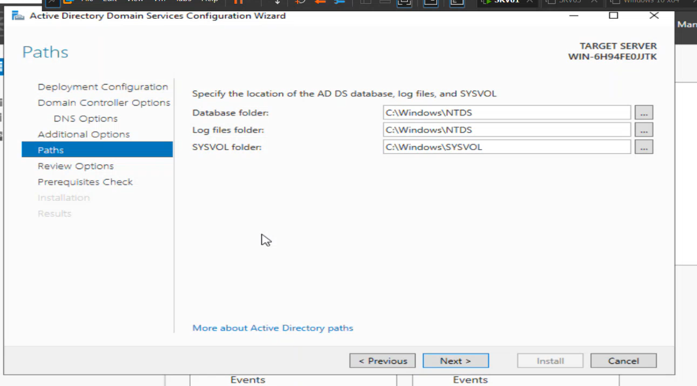

---

### Step 2 - Promoting the Server to a Domain Controller

After the installation is completed, click:

```text
Promote this server to a domain controller
```

to begin the Active Directory configuration.

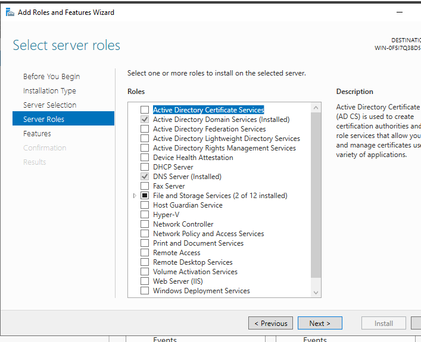

---

### Step 3 - Creating a New Forest

Select **Add a new forest** and enter the root domain name.

```text
VTC.local
```

This creates the first Active Directory Forest for the lab environment.

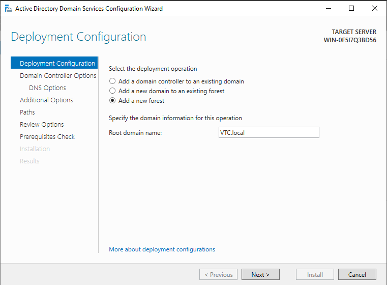

---

### Step 4 - Configuring the Active Directory Database

Configure the default locations for:

- NTDS Database
- Log Files
- SYSVOL

These folders are used to store the Active Directory database and replication files.

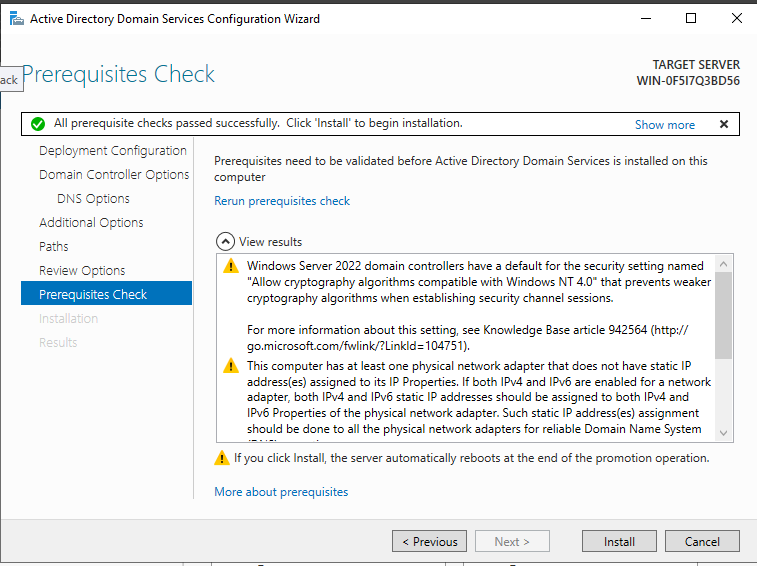

---

## Configuration Summary

| Configuration | Value |
|--------------|-------|
| Forest | VTC.local |
| Domain | VTC.local |
| Domain Controller | SRV01 |
| DNS | Installed Automatically |
| Global Catalog | Enabled |
| Database | C:\Windows\NTDS |
| SYSVOL | C:\Windows\SYSVOL |

---

## Verification

The installation was verified by confirming:

- AD DS role installed successfully.
- VTC.local forest created successfully.
- Server promoted as the Domain Controller.
- DNS installed together with Active Directory.
- Active Directory database configured successfully.

---

## Skills Demonstrated

- Windows Server 2022 Administration
- Active Directory Domain Services
- Domain Controller Deployment
- Forest Creation
- Identity and Access Management (IAM)
- Enterprise Infrastructure Administration
- VMware Virtualization

---

## Result

The Windows Server 2022 machine was successfully promoted as the first Domain Controller for the **VTC.local** domain. Active Directory is now ready to provide centralized authentication and enterprise directory services.

# Part 02 - DNS Server Configuration

## Objective

The objective of this phase is to configure the **Domain Name System (DNS)** service on Windows Server 2022. DNS is an essential component of Active Directory because it enables domain controllers, users, and computers to locate network resources using hostnames instead of IP addresses.

---

## What is DNS?

The **Domain Name System (DNS)** translates human-readable domain names into IP addresses. In an Active Directory environment, DNS is used to locate domain controllers, authenticate users, and resolve names of servers and services across the network.

Without DNS, Active Directory cannot function correctly.

---

## Why DNS is Important

DNS provides several enterprise features, including:

- Name resolution
- Domain controller location
- Active Directory integration
- Service record (SRV) resolution
- Host record management
- Centralized namespace management

---

## Lab Environment

| Component | Value |
|-----------|-------|
| DNS Server | SRV01 |
| Operating System | Windows Server 2022 |
| Domain | VTC.local |
| DNS Type | Active Directory Integrated |
| Additional Zone | vtctech.online |

---

## Configuration Process

### Step 1 - Open DNS Manager

Open **Server Manager** and navigate to:

```text
Tools
   ↓
DNS
```

The DNS Manager console displays the existing Active Directory integrated zones.

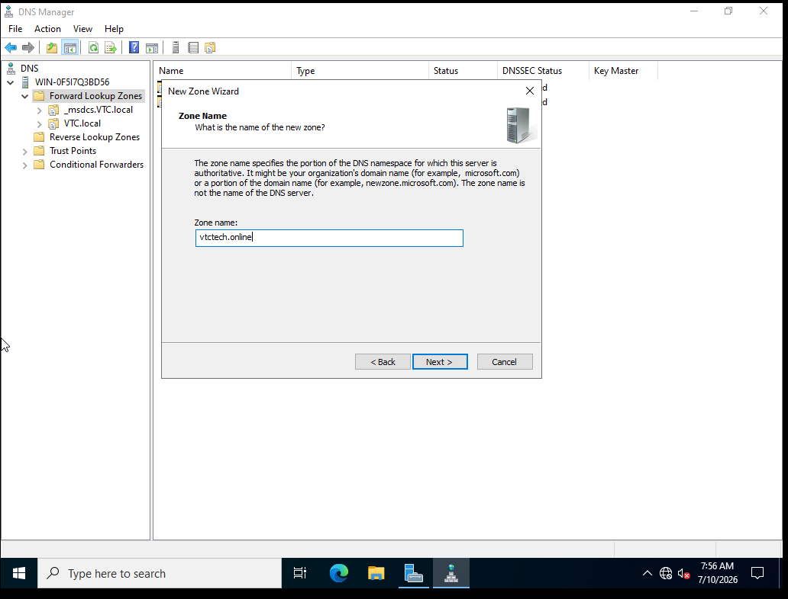

---

### Step 2 - Create a Forward Lookup Zone

Create a new **Forward Lookup Zone**.

Configuration:

- Zone Type: Primary Zone
- Store the zone in Active Directory
- Replication: Domain
- Zone Name:

```text
vtctech.online
```

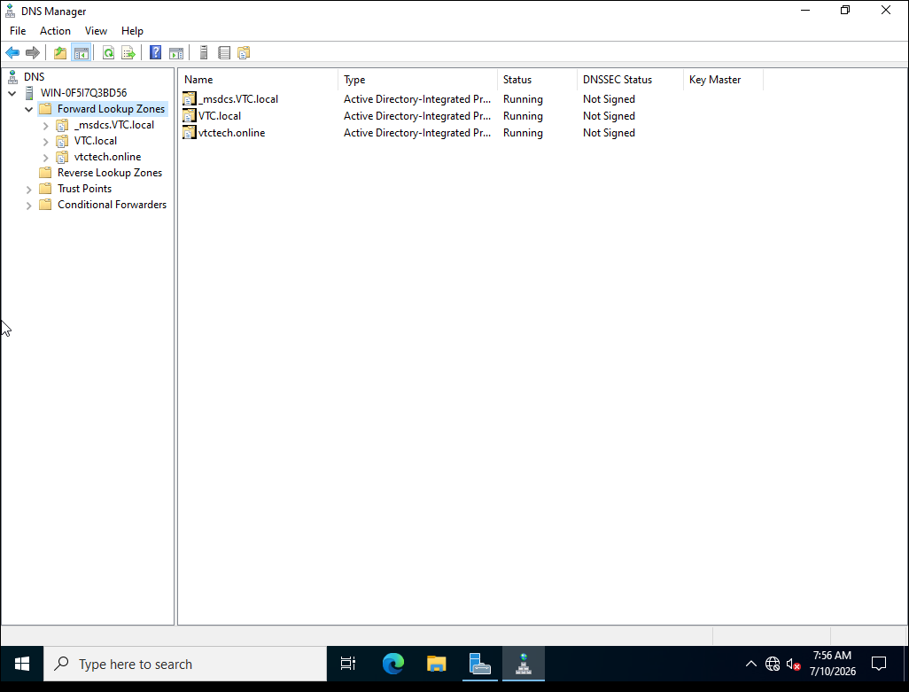

---

## Configuration Summary

| Configuration | Value |
|--------------|-------|
| DNS Server | SRV01 |
| Domain Zone | VTC.local |
| Forest Zone | _msdcs.VTC.local |
| New Forward Lookup Zone | vtctech.online |
| Zone Type | Active Directory Integrated |

---

## Verification

The DNS configuration was verified by confirming:

- DNS Manager opened successfully.
- Active Directory integrated zones were available.
- The **VTC.local** zone was present.
- The **_msdcs.VTC.local** zone was created automatically.
- The new **vtctech.online** Forward Lookup Zone was successfully created.

---

## Skills Demonstrated

- Windows DNS Administration
- Active Directory Integrated DNS
- Forward Lookup Zone Configuration
- DNS Zone Management
- Enterprise Name Resolution
- Windows Server Administration

---

## Result

The DNS Server was successfully configured as part of the Active Directory infrastructure. Active Directory zones were automatically created, and an additional Forward Lookup Zone (**vtctech.online**) was added to demonstrate enterprise DNS management and name resolution.

# Part 03 - Dynamic Host Configuration Protocol (DHCP) Server Configuration

## Objective

The objective of this phase is to install and configure the **Dynamic Host Configuration Protocol (DHCP)** service on Windows Server 2022. DHCP automates IP address allocation and network configuration for client computers, eliminating the need for manual IP configuration in an enterprise environment.

---

## What is DHCP?

**Dynamic Host Configuration Protocol (DHCP)** is a network service that automatically assigns IP addresses and other TCP/IP configuration settings to client devices.

Instead of manually configuring every computer with an IP address, DHCP dynamically provides:

- IP Address
- Subnet Mask
- Default Gateway
- DNS Server
- Lease Duration

This simplifies network administration and reduces configuration errors.

---

## Why DHCP is Important

DHCP provides several enterprise benefits, including:

- Automatic IP address assignment
- Centralized IP management
- Reduced configuration errors
- Simplified network administration
- Efficient IP address utilization
- Faster deployment of client computers

---

## Lab Environment

| Component | Value |
|-----------|-------|
| DHCP Server | SRV01 |
| Operating System | Windows Server 2022 |
| Domain | VTC.local |
| Network | 192.168.100.0/24 |

---

## Configuration Process

### Step 1 - Install the DHCP Server Role

Open **Server Manager** and navigate to:

```text
Manage
   ↓
Add Roles and Features
```

Select **DHCP Server** and complete the installation wizard.

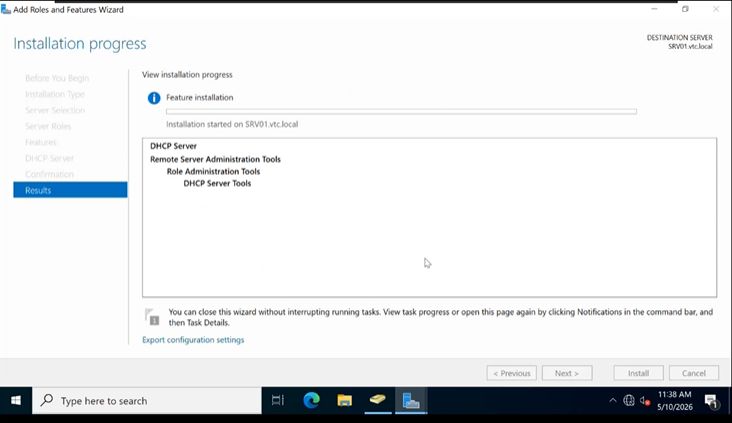

---

### Step 2 - Create a New DHCP Scope

Create a new IPv4 scope.

Configuration:

- Scope Name: **VTC-lab05**

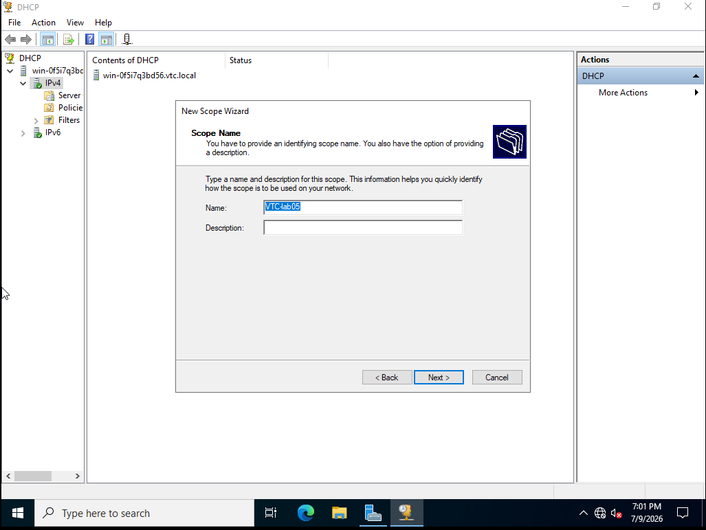

---

### Step 3 - Configure the IP Address Range

Configure the DHCP address pool.

| Setting | Value |
|---------|-------|
| Start IP | 192.168.100.2 |
| End IP | 192.168.100.254 |
| Subnet Mask | 255.255.255.0 |


---

### Step 4 - Configure the Exclusion Range

Reserve IP addresses for servers and network devices.

| Setting | Value |
|---------|-------|
| Start | 192.168.100.2 |
| End | 192.168.100.20 |

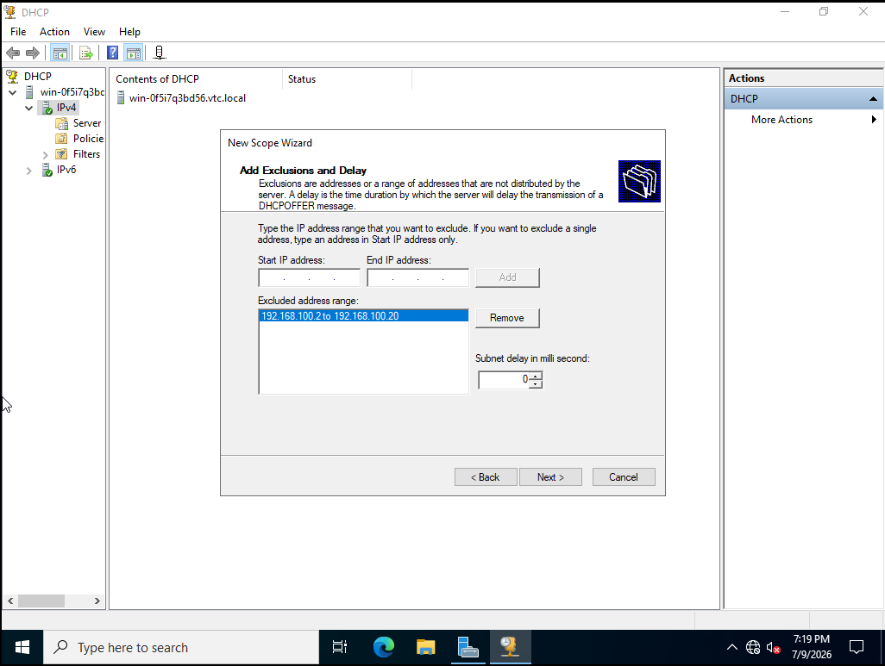

---

### Step 5 - Configure the Lease Duration

Set the lease duration for DHCP clients.

| Setting | Value |
|---------|-------|
| Lease Duration | 8 Days |

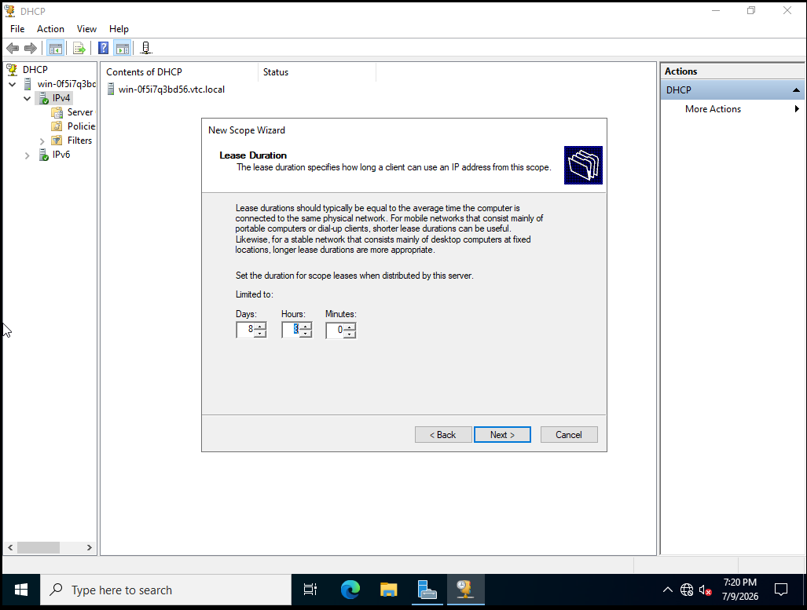

---

### Step 6 - Configure the Default Gateway

Specify the router (default gateway).

| Setting | Value |
|---------|-------|
| Gateway | 192.168.100.1 |

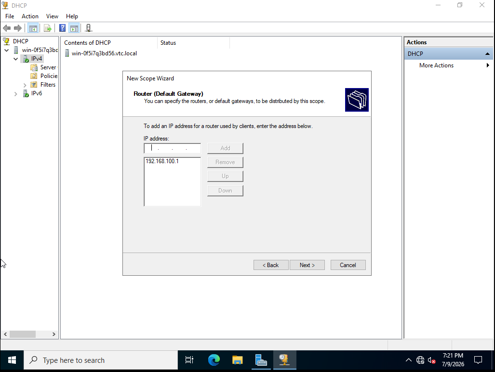

---

### Step 7 - Verify DHCP Client Configuration

Verify that the client computer receives an IP address automatically.

The client successfully received:

| Setting | Value |
|---------|-------|
| IP Address | 192.168.100.21 |
| DHCP Server | 192.168.100.254 |
| DNS Server | 192.168.100.254 |
| Domain | VTC.local |

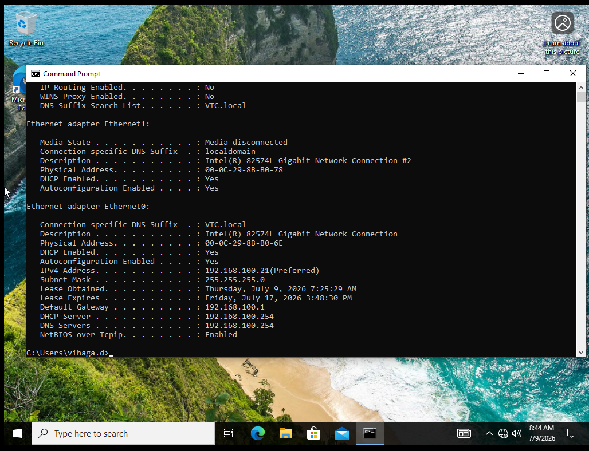

---

### Step 8 - Verify Address Lease

Open the DHCP console and verify that the client has received an IP lease.

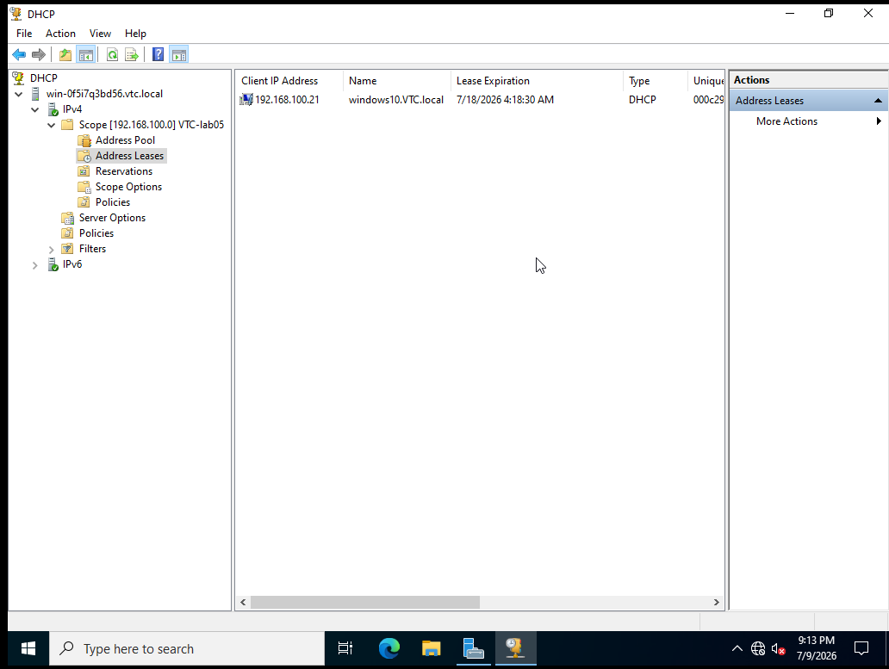

---

## Configuration Summary

| Configuration | Value |
|--------------|-------|
| DHCP Server | SRV01 |
| Scope Name | VTC-lab05 |
| Network | 192.168.100.0/24 |
| Address Pool | 192.168.100.2 - 192.168.100.254 |
| Exclusion Range | 192.168.100.2 - 192.168.100.20 |
| Default Gateway | 192.168.100.1 |
| DNS Server | 192.168.100.254 |
| Lease Duration | 8 Days |

---

## Verification

The DHCP configuration was verified by confirming:

- DHCP Server role installed successfully.
- IPv4 Scope created successfully.
- Address pool configured.
- Exclusion range configured.
- Default gateway configured.
- Client received an IP address automatically.
- Client received DNS configuration.
- Address lease displayed in the DHCP console.

---

## Skills Demonstrated

- Windows DHCP Administration
- DHCP Scope Configuration
- IP Address Management (IPAM)
- DHCP Lease Management
- Enterprise Network Administration
- TCP/IP Configuration
- Windows Server Administration

---

## Result

The DHCP Server was successfully deployed and configured. Client computers automatically received IP addresses, DNS configuration, and gateway settings from the Windows Server 2022 DHCP service, demonstrating centralized IP address management in an enterprise network.

# Part 04 - Organizational Unit (OU) Creation

## Objective

The objective of this phase is to design and implement a structured **Organizational Unit (OU)** hierarchy within Active Directory. Organizational Units provide a logical way to organize users and computers based on departments, making administration, delegation, and Group Policy deployment easier.

---

## What is an Organizational Unit (OU)?

An **Organizational Unit (OU)** is a container in Active Directory used to organize users, groups, computers, and other objects into a logical hierarchy.

Unlike folders, OUs allow administrators to:

- Apply Group Policies
- Delegate administrative control
- Organize departments
- Simplify Active Directory management

---

## Why Organizational Units are Important

Using Organizational Units provides several enterprise benefits:

- Logical organization of Active Directory objects
- Simplified administration
- Department-based management
- Easier Group Policy deployment
- Delegation of administrative permissions
- Scalable Active Directory design

---

## Lab Environment

| Component | Value |
|-----------|-------|
| Domain | VTC.local |
| Server | SRV01 |
| Active Directory | Users and Computers |
| Top Level OU | VTC |

---

## Configuration Process

### Step 1 - Open Active Directory Users and Computers

Open **Server Manager** and navigate to:

```text
Tools
   ↓
Active Directory Users and Computers
```

---

### Step 2 - Create Department Organizational Units

Created the following department Organizational Units:

- HR_Department
- MKT_Department

These OUs separate users and computers according to business departments.

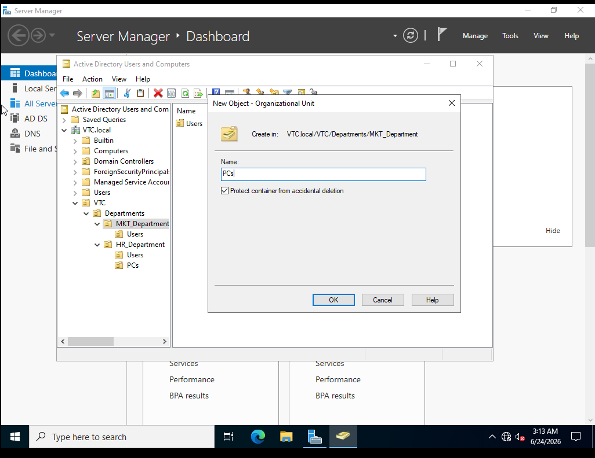

---

### Step 3 - Create Child Organizational Units

Inside each department, create two additional OUs.

For example:

```text
HR_Department
│
├── Users
└── PCs
```

```text
MKT_Department
│
├── Users
└── PCs
```

This structure separates user accounts from computer accounts.

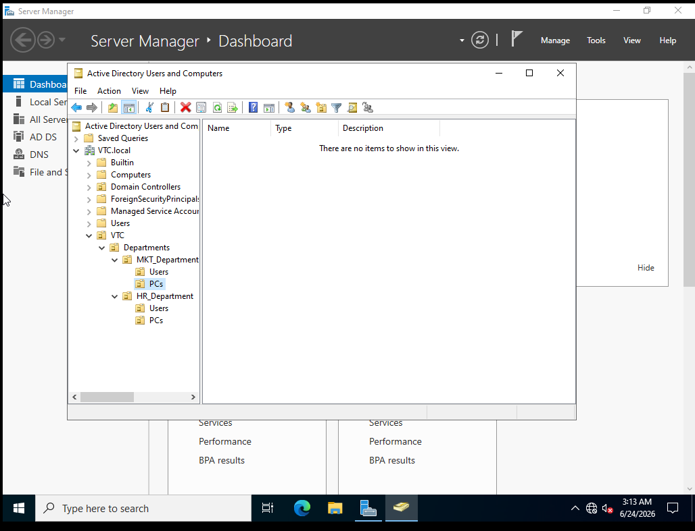

---

## Final Organizational Structure

```text
VTC.local
│
└── VTC
    │
    └── Departments
         │
         ├── HR_Department
         │      ├── Users
         │      └── PCs
         │
         └── MKT_Department
                ├── Users
                └── PCs
```

---

## Configuration Summary

| Configuration | Value |
|--------------|-------|
| Domain | VTC.local |
| Parent OU | VTC |
| Departments | HR_Department, MKT_Department |
| Child OUs | Users, PCs |

---

## Verification

The OU configuration was verified by confirming:

- Parent Organizational Unit created successfully.
- Department OUs created successfully.
- Users OU created successfully.
- PCs OU created successfully.
- Active Directory hierarchy organized correctly.

---

## Skills Demonstrated

- Active Directory Administration
- Organizational Unit Design
- Enterprise Directory Structure
- Department-Based Administration
- Group Policy Planning
- Windows Server Administration

---

## Result

A structured Organizational Unit hierarchy was successfully implemented within the **VTC.local** domain. Department-based OUs and dedicated Users and PCs containers provide a scalable foundation for centralized administration, delegated management, and future Group Policy deployment.

# Part 05 - Active Directory User Creation

## Objective

The objective of this phase is to create and manage **Active Directory user accounts** within department-specific Organizational Units (OUs). Centralized user management enables secure authentication, simplified administration, and efficient identity management across the enterprise network.

---

## What is an Active Directory User?

An **Active Directory User** is a digital identity used to authenticate users within a Windows domain. Each user has a unique username and password that allows secure access to domain resources such as computers, shared folders, printers, and applications.

Unlike local user accounts, domain user accounts are centrally managed from the Domain Controller.

---

## Why User Management is Important

Active Directory user management provides several enterprise benefits:

- Centralized user authentication
- Secure access to network resources
- Simplified account management
- Department-based administration
- Group Policy application
- Improved security and auditing

---

## Lab Environment

| Component | Value |
|-----------|-------|
| Domain | VTC.local |
| Server | SRV01 |
| Management Tool | Active Directory Users and Computers |
| User Location | Department Organizational Units |

---

## Configuration Process

### Step 1 - Open Active Directory Users and Computers

Open **Server Manager** and navigate to:

```text
Tools
   ↓
Active Directory Users and Computers
```

---

### Step 2 - Navigate to the Department OU

Navigate to the appropriate department.

Example:

```text
VTC.local
   ↓
VTC
   ↓
Departments
   ↓
HR_Department
   ↓
Users
```

---

### Step 3 - Create a New User

Right-click the **Users** Organizational Unit and select:

```text
New
   ↓
User
```

Enter the required user information:

- First Name
- Last Name
- User Logon Name
- Password

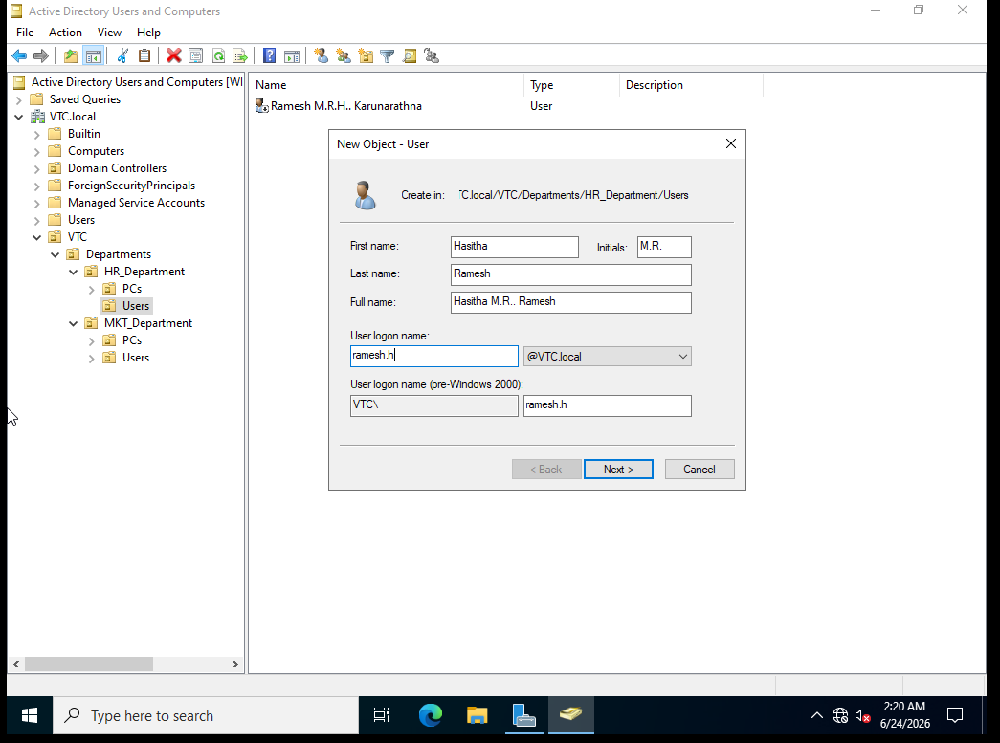

---

### Step 4 - Verify the User Account

After completing the wizard, verify that the new user account appears inside the department's **Users** Organizational Unit.

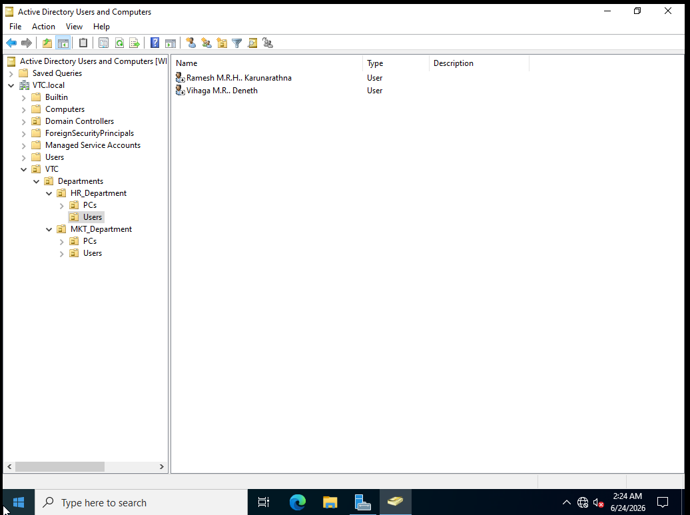

---

## Configuration Summary

| Configuration | Value |
|--------------|-------|
| Domain | VTC.local |
| User Container | Department Users OU |
| Authentication | Active Directory |
| Account Type | Domain User |

---

## Verification

The user creation process was verified by confirming:

- User account created successfully.
- User stored inside the correct Organizational Unit.
- User logon name configured correctly.
- User available for domain authentication.

---

## Skills Demonstrated

- Active Directory User Management
- Identity Administration
- Domain User Provisioning
- Organizational Unit Administration
- Windows Server Administration
- Enterprise Identity Management

---

## Result

Domain user accounts were successfully created and organized within department-specific Organizational Units. This provides centralized authentication, simplifies user administration, and establishes the foundation for Group Policy application and access control in the enterprise environment.

# Part 06 - Active Directory Security Group Creation

## Objective

The objective of this phase is to create and manage **Active Directory Security Groups** to simplify permission management and implement Role-Based Access Control (RBAC) within the enterprise environment.

---

## What is a Security Group?

An **Active Directory Security Group** is a collection of user accounts that share the same access permissions. Instead of assigning permissions individually to each user, administrators assign permissions to a security group and then add users to that group.

This approach simplifies administration and improves security.

---

## Why Security Groups are Important

Security Groups provide several enterprise benefits:

- Centralized permission management
- Simplified administration
- Role-Based Access Control (RBAC)
- Easier resource access management
- Reduced administrative effort
- Improved security

---

## Lab Environment

| Component | Value |
|-----------|-------|
| Domain | VTC.local |
| Server | SRV01 |
| Management Tool | Active Directory Users and Computers |
| Group Location | VTC → Groups |

---

## Configuration Process

### Step 1 - Open Active Directory Users and Computers

Open **Server Manager** and navigate to:

```text
Tools
   ↓
Active Directory Users and Computers
```

---

### Step 2 - Navigate to the Groups Organizational Unit

Navigate to:

```text
VTC.local
   ↓
VTC
   ↓
Groups
```

---

### Step 3 - Create a New Security Group

Right-click the **Groups** Organizational Unit and select:

```text
New
   ↓
Group
```

Configure the following settings:

| Setting | Value |
|---------|-------|
| Group Name | level01 |
| Group Scope | Global |
| Group Type | Security |

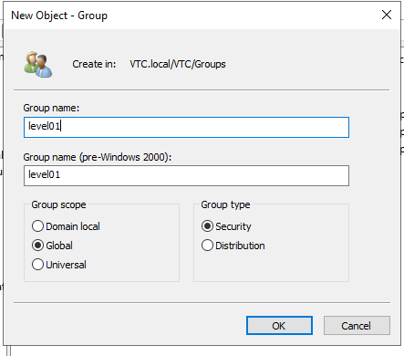

---

### Step 4 - Verify the Security Groups

After creating the group, verify that the new Security Group appears in the **Groups** Organizational Unit.

Example groups:

- HRDPT
- ITDPT
- level01
- level02
- level03

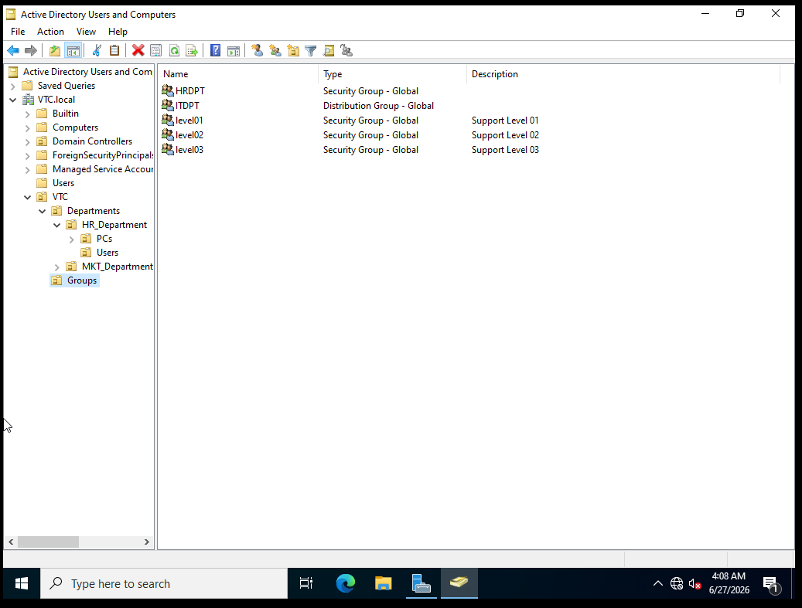

---

## Configuration Summary

| Configuration | Value |
|--------------|-------|
| Domain | VTC.local |
| OU | Groups |
| Group Scope | Global |
| Group Type | Security |
| Sample Groups | HRDPT, ITDPT, level01, level02, level03 |

---

## Verification

The Security Group configuration was verified by confirming:

- Security Groups created successfully.
- Groups stored in the correct Organizational Unit.
- Group Scope configured as Global.
- Group Type configured as Security.
- Department and support-level groups available for user assignment.

---

## Skills Demonstrated

- Active Directory Administration
- Security Group Management
- Role-Based Access Control (RBAC)
- Identity and Access Management (IAM)
- Enterprise User Management
- Windows Server Administration

---

## Result

Security Groups were successfully created and organized within the **Groups** Organizational Unit. These groups provide a scalable and secure method for managing user permissions, simplifying administration, and implementing Role-Based Access Control (RBAC) in the Active Directory environment.

# Part 07 - Delegation of Control

## Objective

The objective of this phase is to delegate administrative permissions to a designated security group without granting full Domain Administrator privileges. This follows the **Principle of Least Privilege (PoLP)**, allowing administrators to perform specific tasks while maintaining the security of the Active Directory environment.

---

## What is Delegation of Control?

Delegation of Control is an Active Directory feature that allows administrators to assign specific administrative tasks to users or security groups without making them members of the **Domain Admins** group.

Instead of giving full administrative privileges, only the required permissions are delegated to authorized personnel.

---

## Why Delegation of Control is Important

Delegating administrative tasks provides several enterprise benefits:

- Implements the Principle of Least Privilege (PoLP)
- Reduces security risks
- Prevents unnecessary administrative access
- Simplifies department-based administration
- Improves accountability
- Supports enterprise security best practices

---

## Lab Environment

| Component | Value |
|-----------|-------|
| Domain | VTC.local |
| Server | SRV01 |
| Management Tool | Active Directory Users and Computers |
| Security Group | level01 |

---

## Configuration Process

### Step 1 - Open Active Directory Users and Computers

Open **Server Manager** and navigate to:

```text
Tools
   ↓
Active Directory Users and Computers
```

---

### Step 2 - Start the Delegation of Control Wizard

Right-click the required Organizational Unit and select:

```text
Delegate Control...
```

The Delegation of Control Wizard opens.

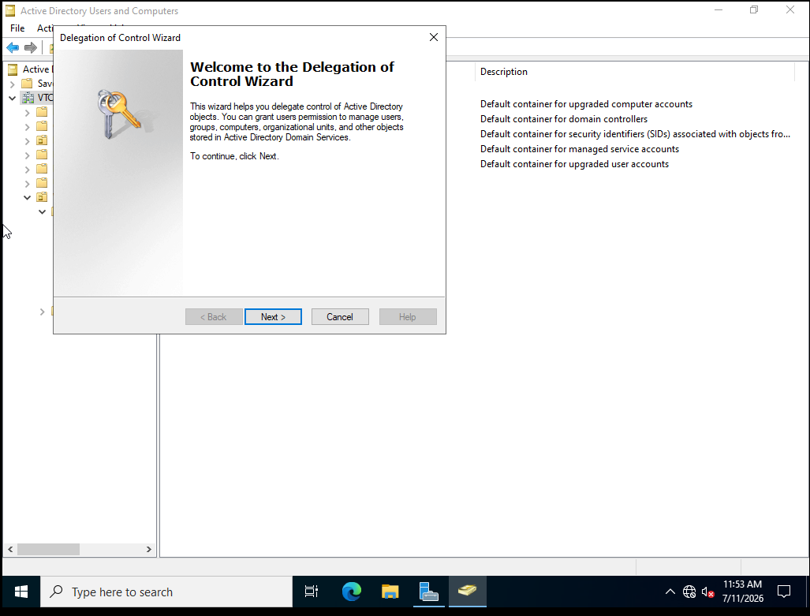

---

### Step 3 - Select the Security Group

Select the security group that will receive delegated administrative permissions.

Example:

```text
level01
```

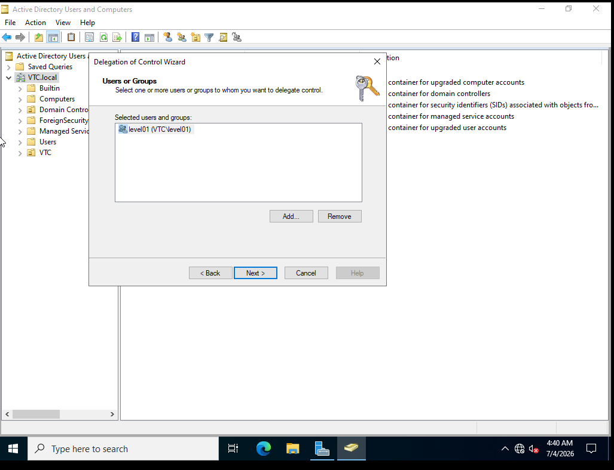

---

### Step 4 - Assign Administrative Tasks

Select the administrative tasks that should be delegated.

Examples include:

- Reset user passwords
- Create user accounts
- Delete user accounts
- Modify user properties
- Manage group membership

Only the required permissions should be delegated.

---

## Configuration Summary

| Configuration | Value |
|--------------|-------|
| Domain | VTC.local |
| Delegated Group | level01 |
| Management Method | Delegation of Control Wizard |
| Security Principle | Least Privilege |

---

## Verification

The Delegation of Control configuration was verified by confirming:

- Delegation of Control Wizard completed successfully.
- Security group **level01** selected.
- Administrative permissions assigned successfully.
- Delegated administration configured without granting Domain Administrator privileges.

---

## Skills Demonstrated

- Active Directory Administration
- Delegated Administration
- Delegation of Control
- Least Privilege Administration
- Role-Based Administration
- Enterprise Security
- Windows Server Administration

---

## Result

Administrative permissions were successfully delegated to the **level01** security group using the Delegation of Control Wizard. This implementation follows enterprise security best practices by granting only the permissions required to perform designated administrative tasks while protecting the overall Active Directory infrastructure.

# Part 08 - Windows Client Domain Join

## Objective

The objective of this phase is to join a Windows 10 client computer to the **VTC.local** Active Directory domain. This enables centralized authentication, policy management, and access to enterprise resources using domain credentials.

---

## What is Domain Join?

A **Domain Join** is the process of connecting a client computer to an Active Directory domain.

Once joined, the client computer can:

- Authenticate using domain user accounts
- Receive Group Policy Objects (GPOs)
- Access shared network resources
- Be centrally managed by administrators

---

## Why Domain Join is Important

Joining computers to an Active Directory domain provides several enterprise benefits:

- Centralized authentication
- Centralized computer management
- Automatic Group Policy application
- Improved security
- Simplified administration
- Enterprise resource access

---

## Lab Environment

| Component | Value |
|-----------|-------|
| Domain | VTC.local |
| Domain Controller | SRV01 |
| Client Operating System | Windows 10 Pro |
| Client Name | CL01 |
| Server IP | 192.168.100.254 |

---

## Configuration Process

### Step 1 - Configure the Domain Controller Network Settings

Configure a static IP address on the Domain Controller.

| Setting | Value |
|---------|-------|
| IP Address | 192.168.100.254 |
| Subnet Mask | 255.255.255.0 |
| Default Gateway | 192.168.100.1 |
| Preferred DNS | 192.168.100.254 |

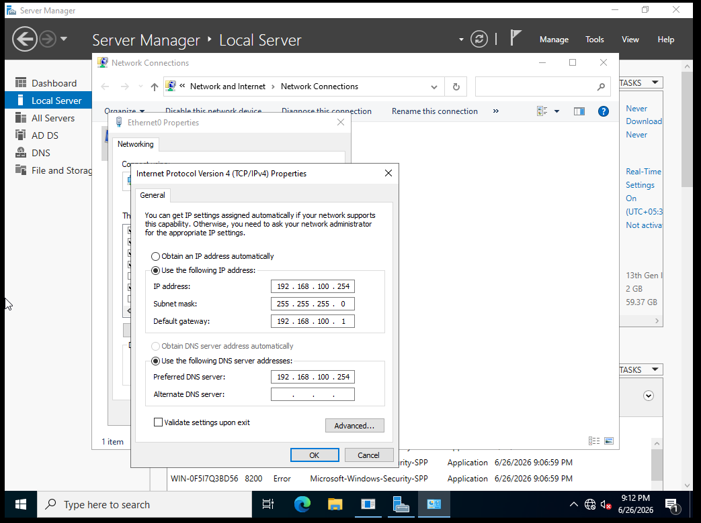

---

### Step 2 - Configure the Client Network Settings

Configure the client computer with the correct network settings.

| Setting | Value |
|---------|-------|
| IP Address | 192.168.100.2 |
| Subnet Mask | 255.255.255.0 |
| Default Gateway | 192.168.100.1 |
| Preferred DNS | 192.168.100.254 |

The client uses the Domain Controller as its DNS server.

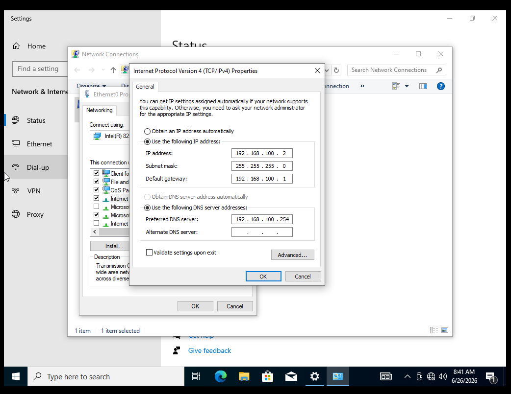

---

### Step 3 - Test Network Connectivity

Verify communication between the client and the Domain Controller using the **ping** command.

```text
ping 192.168.100.254
```

Successful replies confirm that the client can communicate with the Domain Controller.

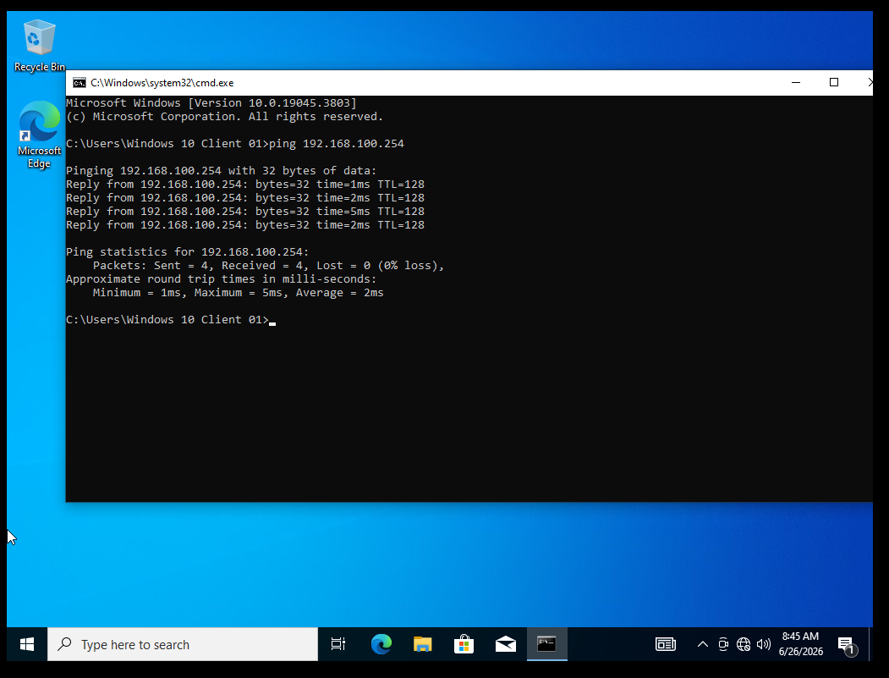

---

### Step 4 - Join the Computer to the Domain

Open:

```text
System Properties
     ↓
Computer Name
     ↓
Change
```

Select **Domain** and enter:

```text
VTC.local
```

Provide domain administrator credentials when prompted.

After successful authentication, Windows displays:

```text
Welcome to the VTC.local domain.
```

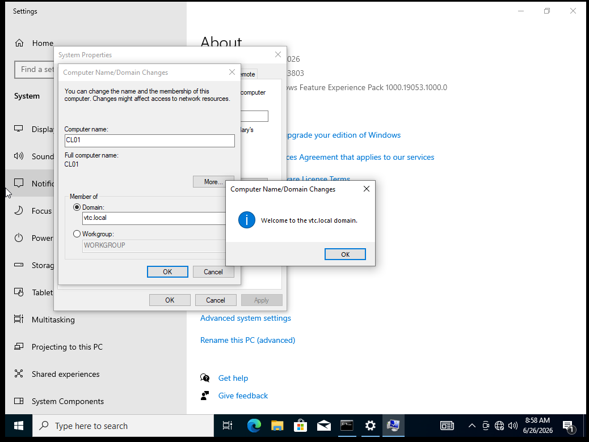

---

### Step 5 - Verify Domain Login

Restart the client computer.

At the Windows sign-in screen, verify that the computer authenticates against the **VTC.local** domain.

Log in using a domain user account.

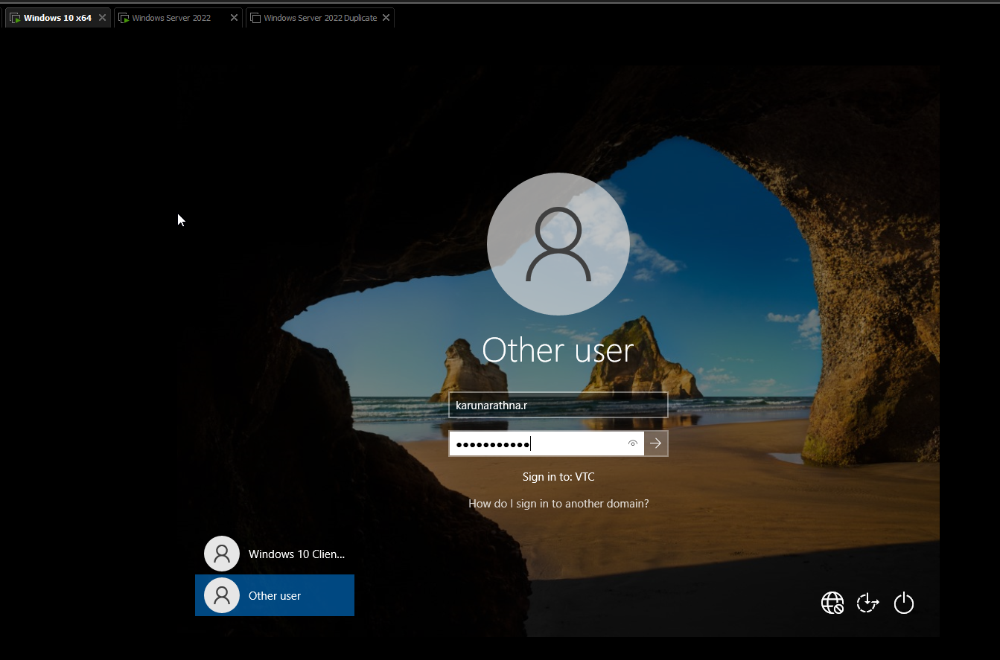

---

## Configuration Summary

| Configuration | Value |
|--------------|-------|
| Domain | VTC.local |
| Domain Controller | SRV01 |
| Client | Windows 10 Pro |
| Authentication | Active Directory |
| DNS | 192.168.100.254 |

---

## Verification

The Domain Join process was verified by confirming:

- Domain Controller network configured successfully.
- Client network configured successfully.
- Successful network connectivity using Ping.
- Client successfully joined the **VTC.local** domain.
- Domain authentication completed successfully.

---

## Skills Demonstrated

- Active Directory Administration
- Windows Client Administration
- Domain Join
- TCP/IP Configuration
- DNS Configuration
- Enterprise Authentication
- Windows Server Administration

---

## Result

The Windows 10 client computer was successfully joined to the **VTC.local** Active Directory domain. The client can now authenticate using domain user accounts, receive Group Policy Objects (GPOs), and be centrally managed by the Domain Controller.

# Part 09 - Remote Server Administration Tools (RSAT)

## Objective

The objective of this phase is to install and configure **Remote Server Administration Tools (RSAT)** on a Windows 10 client computer. RSAT allows administrators to remotely manage Active Directory and other Windows Server roles without logging directly into the Domain Controller.

---

## What is RSAT?

**Remote Server Administration Tools (RSAT)** is a collection of Microsoft management tools that enables administrators to remotely manage Windows Server roles and features from a Windows client computer.

Instead of signing in to the Domain Controller using Remote Desktop, administrators can perform daily management tasks directly from their workstation.

---

## Why RSAT is Important

RSAT provides several enterprise benefits:

- Remote administration
- Improved security
- Reduced server logins
- Simplified administration
- Centralized management
- Enterprise best practice

---

## Lab Environment

| Component | Value |
|-----------|-------|
| Domain | VTC.local |
| Client Operating System | Windows 10 Pro |
| Server | SRV01 |
| Management Tool | RSAT |
| Administration | Remote |

---

## Configuration Process

### Step 1 - Install RSAT

Download and install the **Remote Server Administration Tools (RSAT)** package on the Windows 10 client computer.

The installation includes tools such as:

- Active Directory Users and Computers
- DNS Manager
- DHCP Manager
- Group Policy Management
- Active Directory Administrative Center

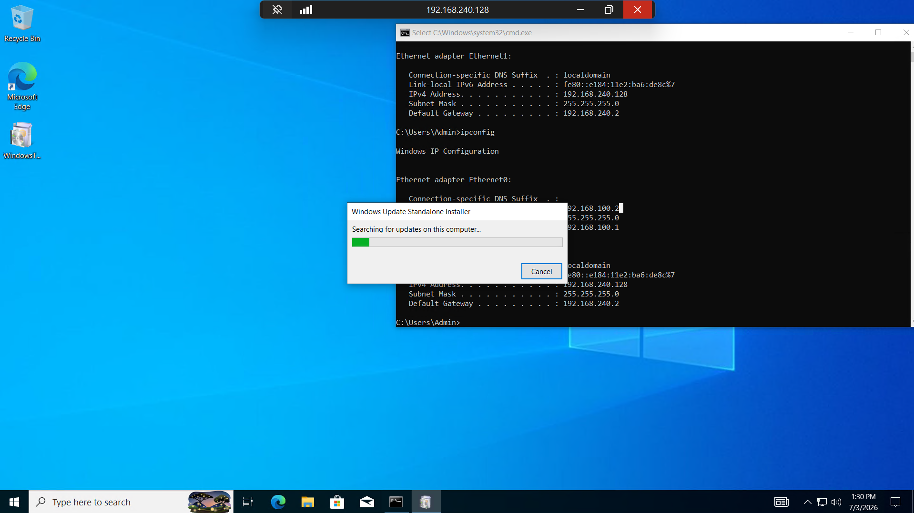

---

### Step 2 - Configure Delegated Administration

Open **Active Directory Users and Computers** using RSAT.

Use the **Delegation of Control Wizard** to assign administrative permissions to the **level01** Security Group.

This allows delegated administrators to perform specific management tasks without becoming members of the **Domain Admins** group.


---

## Configuration Summary

| Configuration | Value |
|--------------|-------|
| Client | Windows 10 Pro |
| Domain | VTC.local |
| Tool | RSAT |
| Administration | Remote |
| Delegated Group | level01 |

---

## Verification

The RSAT configuration was verified by confirming:

- RSAT installed successfully.
- Active Directory management tools available.
- Domain connection established.
- Delegated administration configured successfully.
- Remote management completed without logging directly into the Domain Controller.

---

## Skills Demonstrated

- Windows Server Administration
- RSAT Deployment
- Remote Administration
- Active Directory Management
- Delegation of Control
- Enterprise Windows Administration

---

## Result

Remote Server Administration Tools (RSAT) were successfully installed on the Windows 10 client. The client computer can now remotely manage Active Directory and other Windows Server services without requiring direct access to the Domain Controller, following enterprise administration best practices.

# Part 10 - Network Architecture

## Lab Network Topology

The following diagram illustrates the virtual enterprise environment built using VMware Workstation.

```text
                           VMware Workstation
                                  │
        ┌─────────────────────────┼─────────────────────────┐
        │                         │                         │
        │                         │                         │
   Windows Server 2022       Windows Server 2022      Windows 10 Pro
         SRV01                     SRV02                  CL01
   Domain Controller          Member Server          Domain Client
        │                          │                     │
        │                          │                     │
   • Active Directory         • Member Server      • Domain Joined
   • DNS Server               • (Future Services)  • Domain User Login
   • DHCP Server                                • RSAT Administration
   • Authentication
   • Directory Services

Network: 192.168.100.0/24
Domain: VTC.local
```

## Infrastructure Overview

The virtual lab consists of one Domain Controller, one Member Server, and one Windows 10 client. The Domain Controller provides centralized authentication, DNS, and DHCP services, while the client computer is joined to the Active Directory domain and managed centrally.

# Part 11 - Technologies Used

| Technology | Purpose |
|------------|---------|
| VMware Workstation | Virtualization Platform |
| Windows Server 2022 | Server Operating System |
| Windows 10 Pro | Client Operating System |
| Active Directory Domain Services | Identity Management |
| DNS Server | Name Resolution |
| DHCP Server | Dynamic IP Address Allocation |
| Organizational Units | Directory Organization |
| Security Groups | Permission Management |
| RSAT | Remote Administration |
| TCP/IP | Network Communication |
| ICMP (Ping) | Connectivity Testing |

# Part 12 - Skills Gained

During this project, I gained practical experience in:

- Windows Server 2022 Administration
- Active Directory Domain Services (AD DS)
- Domain Controller Deployment
- DNS Administration
- DHCP Administration
- Organizational Unit (OU) Design
- Active Directory User Management
- Security Group Administration
- Delegation of Control
- Domain Join
- Remote Server Administration (RSAT)
- TCP/IP Configuration
- Enterprise Network Administration
- Identity and Access Management (IAM)
- VMware Virtualization

# Part 13 - Key Learning Outcomes

This project helped me understand how enterprise Windows environments are designed and managed.

Key learning outcomes include:

- Building an Active Directory infrastructure from scratch.
- Designing an Organizational Unit hierarchy.
- Managing users and security groups.
- Configuring DNS and DHCP services.
- Joining client computers to a domain.
- Implementing delegated administration.
- Performing remote administration using RSAT.
- Understanding enterprise authentication and centralized management.

# Part 14 - Future Improvements

This project will be expanded in the future by implementing:

- Group Policy Management
- Software Deployment using Group Policy
- Windows Firewall Management
- IIS Web Server
- File Server
- Print Server
- Windows Server Backup
- Windows Server Update Services (WSUS)
- Certificate Services (AD CS)
- PowerShell Automation

# Part 15 - Conclusion

This project successfully demonstrates the implementation of an enterprise Active Directory infrastructure using Windows Server 2022 within a VMware Workstation virtual environment.

The lab includes the deployment of Active Directory Domain Services, DNS, DHCP, Organizational Units, user and group management, delegated administration, client domain joining, and remote server administration.

This hands-on project strengthened my practical knowledge of Windows Server administration and enterprise network management while providing real-world experience in deploying and managing Microsoft infrastructure services.

# Part 16 - Repository Structure

```text
Enterprise-Active-Directory-Infrastructure/
│
├── README.md
│
└── screenshots/
    ├── 01-ad-ds-role-installation.png
    ├── 02-promote-domain-controller.png
    ├── 03-create-new-forest.png
    ├── 04-ad-ds-configuration.png
    ├── 05-dns-manager.png
    ├── 06-create-forward-lookup-zone.png
    ├── 07-install-dhcp-role.png
    ├── 08-create-dhcp-scope.png
    ├── 09-ip-address-range.png
    ├── 10-exclusion-range.png
    ├── 11-lease-duration.png
    ├── 12-default-gateway.png
    ├── 13-client-ipconfig.png
    ├── 14-address-leases.png
    ├── 15-department-ou.png
    ├── 16-ou-structure.png
    ├── 17-create-user.png
    ├── 18-user-created.png
    ├── 19-create-security-group.png
    ├── 20-security-groups.png
    ├── 21-delegation-wizard.png
    ├── 22-select-security-group.png
    ├── 23-server-network-configuration.png
    ├── 24-client-network-configuration.png
    ├── 25-ping-test.png
    ├── 26-domain-join.png
    ├── 27-domain-login.png
    ├── 28-install-rsat.png
    └── 29-rsat-management.png
```

# About This Project

This project was completed as part of my hands-on Windows Server administration and enterprise networking practice.

The primary objective was to simulate a real-world Microsoft Active Directory environment using VMware Workstation and Windows Server 2022 while following enterprise administration best practices.

All configurations were implemented, tested, and verified within a virtual lab environment.
